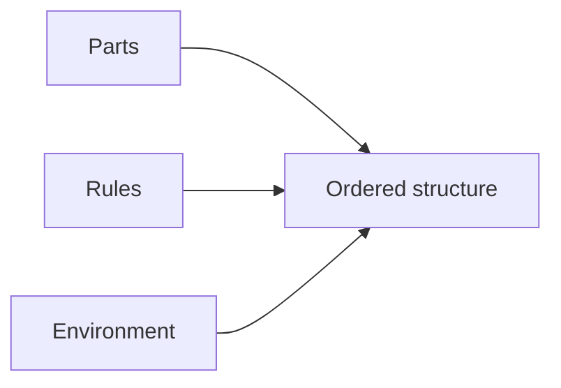

# Chapter 2 — Local rules, energy, and order from disorder

Order does not require a boss. It can come from **many weak, local interactions** plus an environment that lets parts explore.

## The three knobs engineers turn

<PubImg
  src="/images/parts-rules-environment.svg"
  alt="Diagram: parts plus rules plus environment yields order"
  caption="Mental model for every scale — molecules, floatiles, robots."
  credit="Self-Assembly Lab · CC0"
  width={720}
  height={220}
/>

1. **Parts** — shapes, patches, magnet faces, DNA sticky ends, robot bodies.
2. **Rules** — who sticks to whom; which messages neighbors exchange.
3. **Environment** — temperature schedule, shaking, liquid surface, power, time.

Change any knob and the final pattern can change.

## Local rules beat global blueprints (usually)

In many self-assembling systems:

- Each part only “knows” its **neighbors**.
- Nobody draws a full map from the outside every second.
- Global shape is an **emergent** result of local behavior.

That is why Kilobots can form a star with only short-range IR communication — and why DNA tiles grow crystals from sticky-end matching.

<Callout type="info" emoji="📖">
**Glossary — local rule.** A behavior or binding preference that depends only on nearby information (a neighbor robot, a complementary DNA sequence), not on a complete global map.
</Callout>

## Energy: why shaking helps (sometimes)

Parts need a way to **try** arrangements:

| Energy / motion source | Example | Role |
|------------------------|---------|------|
| Thermal jiggling | Molecules in warm water | Explore bindings; anneal DNA origami |
| Gentle agitation | Shaking a tray of magnetic tiles | Break wrong contacts; find better ones |
| Active robots | Vibration motors on Kilobots | Move until a local rule says “stop” |
| Continuous power | Living cells, some soft-matter systems | Dynamic / dissipative order |

Too little motion → stuck in junk piles (**kinetic traps**).  
Too much motion → nothing stays stuck.

<Callout type="info" emoji="📖">
**Glossary — kinetic trap.** The system gets stuck in a wrong or incomplete structure because pathways and timing matter — not only the “best” final energy.
</Callout>

## Order from disorder — concrete pictures

**Crystals.** Randomly moving molecules settle into a lattice when cooling allows stable bonds.

**Capillary floatiles.** Random floating pieces drift into clusters because deformed liquid surfaces create attraction (Cheerios effect). Classroom kits: [UCSD MRSEC](https://mrsec.ucsd.edu/experimental-self-assembly/), [FloaTiles](https://karegeo.github.io/floatiles/).

**Algorithmic tiles.** DNA tiles can encode local matching rules that grow patterned crystals (theory + AFM demos). See Doty’s survey PDF: [algorithmic tiles](https://www.dna.caltech.edu/Papers/algorithmic_tiles2012doty.pdf).

## Watch: robots that only push/pull locally

Particle robots show collective motion from loosely coupled units — another “local physics → global behavior” story.

<YouTube id="wrDdqjQvaoA" title="Particle Robotics — Columbia Engineering" />

Source: [Columbia Engineering — Particle Robotics](https://www.youtube.com/watch?v=wrDdqjQvaoA) (companion to Nature 2019 particle robotics work).

## Try this (paperclip “sticky ends”)

1. Color-code paperclips or craft magnets as “A / A′ / B / B′”.
2. Rule: A only sticks to A′; B only to B′.
3. Mix on a tray; shake gently 30 seconds.
4. Count correct vs wrong attachments.

This is the intuition behind DNA sticky ends — without a wet lab.

## Honesty checkpoint

Local rules **scale beautifully in demos** and **fail messily in products** when defects, energy cost, or manufacturing yield get in the way. That is why we keep the frontier framing on every page.

## Next

→ [Chapter 3 — Molecular toys (DNA origami intuition)](/beginners/chapter-3)
