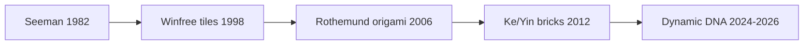

# Molecular / DNA track

From Seeman’s branched junctions to origami, DNA bricks, colloids, and recent multifarious assembly.

<Callout type="warning">
Classroom DNA **wet labs** are deliberately *not* prescribed here (cost, equipment, biosafety programs). Use [Experiment 10](/experiments) — design/simulation only — unless you are in a proper lab program.
</Callout>

## Story arc

## 1. Why DNA? — Seeman (1982)

**Nadrian C. Seeman**, *Nucleic acid junctions and lattices*, *J. Theor. Biol.*  
[DOI](https://doi.org/10.1016/0022-5193(82)90002-9) · [PubMed](https://pubmed.ncbi.nlm.nih.gov/6188926/)

- DNA can be a **building material**, not only genetic storage.
- Immobile branched junctions form designed networks.
- **Sticky-end complementarity** programs which pieces stick together.
- Vision: 3D nucleic-acid lattices as scaffolds.

**Beginner takeaway:** Sequence design = programmable binding rules.

## 2. Tiles that compute — Winfree et al. (1998)

**Winfree, Liu, Wenzler, Seeman**, *Design and self-assembly of two-dimensional DNA crystals*, *Nature*  
[DOI](https://doi.org/10.1038/28998)

- DNA double-crossover molecules act like programmable **Wang tiles**.
- Sticky ends encode edge matching; AFM shows patterned 2D crystals.
- Links computation theory (tiling) to wet-lab nanotech.
- Errors and defects already appear as a practical limit.

**Beginner takeaway:** Algorithmic self-assembly is experimentally real.

## 3. DNA origami — Rothemund (2006)

**Paul W. K. Rothemund**, *Folding DNA to create nanoscale shapes and patterns*, *Nature*  
[DOI](https://doi.org/10.1038/nature04586) · [Author PDF](https://www.dna.caltech.edu/Papers/DNAorigami-nature.pdf)

- **Scaffolded DNA origami:** one long scaffold + many short staples → designed shape.
- Arbitrary 2D shapes (~100 nm) in a single annealing step; ~6 nm “pixel” resolution.
- Opened a practical CAD-like workflow for nanoscale shape design.

**Beginner takeaway:** The demo that made DNA nanotech visually iconic and teachable.  
Watch: [Shih iBiology Part 1](https://www.youtube.com/watch?v=Ek-FDPymyyg).

## 4. DNA bricks — Ke, Ong, Shih, Yin (2012)

**Ke et al.**, *Three-Dimensional Structures Self-Assembled from DNA Bricks*, *Science*  
[DOI](https://doi.org/10.1126/science.1227268) · [Author PDF](https://yin.hms.harvard.edu/publications/2012.bricks.pdf)

- Short DNA “bricks” (no long scaffold) assemble like LEGO voxels into 3D shapes.
- Modular canvas (e.g. 10×10×10) → many structures by choosing which bricks to include.
- Complements origami: discrete voxel library vs one scaffold design.

## 5. Colloidal DNA programming — Mirkin et al. (1996) → Jacobs & Rogers (2024)

**Mirkin et al. (1996)**, *A DNA-based method for rationally assembling nanoparticles…*, *Nature*  
[DOI](https://doi.org/10.1038/382607a0)

**Jacobs & Rogers (2024)**, *Assembly of Complex Colloidal Systems Using DNA* (arXiv review)  
[arXiv:2409.08988](https://arxiv.org/abs/2409.08988)

- DNA coatings program which colloids stick — sequence as interaction code.
- **Kinetics** (nucleation, growth, trapping) matter as much as equilibrium design.
- Temperature windows for crystallization can be extremely narrow.
- Honest: powerful in lab; bulk applications still emerging.

## 6. Multifarious / nonequilibrium — Evans et al. (2024)

**Evans, O’Brien, Winfree, Murugan**, *Pattern recognition in the nucleation kinetics…*, *Nature*  
[DOI](https://doi.org/10.1038/s41586-023-06890-z) · [Supp](https://www.dna.caltech.edu/SupplementaryMaterial/MultifariousSST/)

- One DNA-tile library can form **multiple** target shapes depending on concentration patterns.
- Nucleation kinetics act like a classifier.
- Research-grade (long anneals) — not a kitchen experiment.

## 7. Where the field is going (2025–2026 reviews)

| Paper | Link | Hook |
|-------|------|------|
| Duke et al. 2025 — Dynamic DNA superstructures | [DOI](https://doi.org/10.1039/D5NH00436E) | Beyond static sculptures → machines/materials |
| Piranej et al. 2026 — Programming DNA machines to move | [DOI](https://doi.org/10.1038/s41570-025-00791-7) | Metrics vs biological motors; demystifies “nanorobots” |
| Lipid vesicle molecular robots (2024) | [DOI](https://doi.org/10.1039/D3LC00860F) | Soft “body” framing; field still in infancy |

## Theory companion

**David Doty (2012)**, *Theory of algorithmic self-assembly*, *CACM*  
[DOI](https://doi.org/10.1145/2380656.2380675) · [Author PDF](https://www.dna.caltech.edu/Papers/algorithmic_tiles2012doty.pdf)

Vocabulary: seed, growth frontier, cooperative binding, error correction.

## Practice on this track

- [Experiment 4](/experiments) — paperclip / LEGO sticky-end rules
- [Experiment 6](/experiments) — tile assembly toy model with errors
- [Experiment 10](/experiments) — origami design assignment (CAD only)
- Week 2 Track A in [Learn](/learn)
