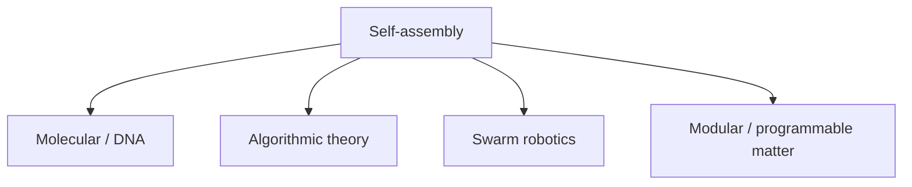

# Self-Assembly Lab

Educational documentation for young scientists and engineers exploring **self-assembly** across molecules, DNA nanostructures, robot swarms, and programmable matter.

<Callout type="warning" emoji="⚗️">
**Frontier reality check.** Engineered self-assembly applications (programmable matter, molecular robots, macroscopic DNA devices) are **mostly undeveloped / lab-scale**. Nature already self-assembles spectacularly. Engineers can *program* interactions. Landmark demos prove principles. Kinetics, errors, energy, manufacturing, and useful strength still limit products. Students learn deeply via simulation and tabletop analogues.
</Callout>

## The idea in one sentence

**Parts + interaction rules + environment → ordered structure** — without a human assembling each piece by hand.

## Five framing points

1. **Nature already self-assembles** — proteins, cells, crystals, flocks.
2. **Engineers program interactions** — DNA sequences, robot local rules, magnets/geometry.
3. **Landmark demos prove principles** — DNA origami, Kilobot swarms.
4. **Limits remain real** — kinetics, defects, energy, cost, useful strength.
5. **You can learn deeply** — simulation + safe tabletop experiments beat waiting for wet-lab access.

## Track map

## Five sources for the home page

Start here — conceptual north stars across scales:

| # | Source | Why it matters |
|---|--------|----------------|
| 1 | [Whitesides & Grzybowski (2002)](https://doi.org/10.1126/science.1070821) — *Self-Assembly at All Scales* | Conceptual map from molecules to planets |
| 2 | [Rothemund (2006)](https://doi.org/10.1038/nature04586) — *DNA origami* | Iconic molecular programming demo ([author PDF](https://www.dna.caltech.edu/Papers/DNAorigami-nature.pdf)) |
| 3 | [Rubenstein, Cornejo & Nagpal (2014)](https://doi.org/10.1126/science.1254295) — *Thousand-robot Kilobot swarm* | Visible algorithmic self-assembly |
| 4 | [Goldstein, Campbell & Mowry (2005)](https://doi.org/10.1109/MC.2005.198) — *Programmable Matter* | Honest vision piece for modular matter |
| 5 | [Seo, Paik & Yim (2019)](https://doi.org/10.1146/annurev-control-053018-023834) — *Modular Reconfigurable Robotics* | Engineering survey of the robotics branch |

## Media strip

Watch / skim these alongside the five papers:

1. **[Harvard Kilobot swarm demo](https://www.youtube.com/watch?v=xK54Bu9HFRw)** — visible, exciting, algorithmic (companion to Science 2014).
2. **[William Shih iBiology — DNA origami](https://www.youtube.com/watch?v=Ek-FDPymyyg)** — serious science lecture, free ([iBiology hub](https://www.ibiology.org/biophysics/nanofabrication/)).
3. **[CMU Claytronics hub](http://www.cs.cmu.edu/~claytronics/index.html)** — aspirational programmable-matter vision (pair with the honesty note above).

## Beginner track (new)

Concrete chapters with pictures and verified videos: **[Beginners](/beginners)** → Ch.1–5.

Practical starter guides: **[Manufacturing](/manufacturing)** · **[Supply chain](/supply-chain)**.

## Where to go next

| Path | Page |
|------|------|
| Beginner chapters + media | [Beginners](/beginners) |
| Vocabulary & foundations | [Concepts](/concepts) |
| DNA / molecular track | [DNA](/dna) |
| Swarm + modular matter | [Robots](/robots) |
| 10 safe starter labs | [Experiments](/experiments) |
| How related hardware is built | [Manufacturing](/manufacturing) |
| BOM & sourcing map | [Supply chain](/supply-chain) |
| 2–4 week learning plan | [Learn](/learn) |
| Full bibliography | [Papers](/papers) |
| Lectures & demos | [Media](/media) |
| Daily frontier digests | [Latest](/latest) |

Corpus curated **2026-09-15** (America/New_York). All DOIs/URLs from the corpus are real and verified — no invented citations.
