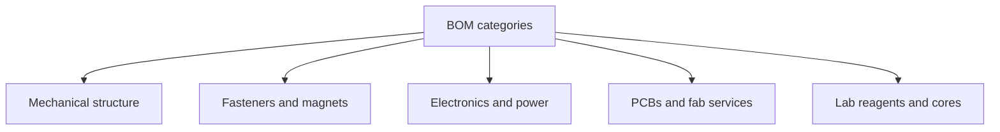

# Supply chain — BOM thinking for starter systems

This is a **shopping and sourcing map for learners**, not a claim that programmable-matter supply chains are mature. Most parts below support *related* hardware: modular toys, swarm prototypes, classroom capillary kits, and supervised molecular education.

<Callout type="warning" emoji="⚗️">
Buy what is standard. Outsource what is exotic. Do not invent a factory org chart for products that still live in papers and demos.
</Callout>

## Think in BOM categories

A **bill of materials (BOM)** lists every part, quantity, vendor, and approx cost. Even a toy module deserves one.

| Category | Examples | Starter sources |
|----------|----------|-----------------|
| Mechanical structure | 3D-print filament, acrylic, plywood | Local makerspace, filament shops |
| Fasteners | M2/M3 screws, heat-set inserts | McMaster-Carr, local hardware |
| Magnets | Neodymium discs/blocks (known grade) | Specialist magnet vendors; some Digi-Key |
| Adhesives | CA, epoxy, double-sided tape | Hardware stores (vented use) |
| Electronics | MCU boards, motors, IR LEDs, sensors | Digi-Key, Mouser, Adafruit, SparkFun |
| Power | LiPo cells, chargers, protection boards | Specialty robotics shops (trained use) |
| PCBs | Custom boards | JLCPCB, PCBWay, OSH Park |
| Lab reagents (educational only) | Buffers, practice oligos | University stores / IDT-class vendors with mentor |
| Fabrication services | CNC, laser, waterjet | Makerspaces, university shops |

## Distributors beginners actually use

- **[Digi-Key](https://www.digikey.com/)** / **[Mouser](https://www.mouser.com/)** — broad electronics catalogs, datasheets, student accounts sometimes available.
- **[Adafruit](https://www.adafruit.com/)** / **[SparkFun](https://www.sparkfun.com/)** — learning-friendly breakouts, tutorials, cables.
- **[McMaster-Carr](https://www.mcmaster.com/)** — mechanical parts, fasteners, raw stock (US-centric).
- **PCB prototype houses** — JLCPCB, PCBWay, OSH Park (compare turnaround vs shipping).
- **Magnet specialists** — buy graded neodymium with published pull force; avoid mystery packs for precision docks.
- **Filament & resin** — local or online; match material to printer and solvent exposure.

Always check export rules, age restrictions, and battery shipping limits.

## University & community infrastructure

Things that are hard to own but easy to **borrow access** to:

| Resource | Why it matters |
|----------|----------------|
| Makerspace (library / nonprofit) | Printers, laser cutters, mentoring |
| University machine shop | Better CNC, training, metrology |
| Electronics teaching lab | Oscilloscopes, soldering stations |
| DNA / nanotech **core facility** | AFM, TEM, annealers, trained staff |
| Shared robotics lab | Motion capture, charging racks, IR programmers |

Ask early: many cores sell **internal rates** to students with a PI or club advisor.

## DNA / molecular supply (educational framing)

For supervised coursework or lab clubs:

1. Design sequences with a mentor.
2. Order oligos from research vendors (IDT and peers are commonly used in teaching labs).
3. Receive dried oligos; resuspend with lab protocols.
4. Use institutional waste streams and biosafety rules.

**Do not** treat online “mystery DNA kits” as a substitute for coursework. Scaffold DNA (e.g. M13-based) and staple sets for origami are research purchases, not grocery items.

## What is hard to buy (plan around it)

| Hard item | Why | Starter workaround |
|-----------|-----|--------------------|
| Custom ASICs | NRE cost enormous | Use commodity MCUs |
| Exotic nanomaterials | Export control, purity, handling | Stick to educational macro demos |
| Research-only modular robots | Not retail products | Simulate; build simplified magnetic modules |
| Industrial DNA origami production | Not a consumer SKU | Design-only + literature study |
| Perfect zero-defect connectors | Physics + wear | Design for error tolerance (swarm lesson!) |

## Open-source designs to start from

Prefer repos and lab pages with licenses you can obey:

- Classroom capillary / floatile projects ([FloaTiles](https://github.com/karegeo/floatiles), [UCSD MRSEC activities](https://mrsec.ucsd.edu/experimental-self-assembly/))
- KiCad templates from Adafruit/SparkFun learning guides
- Modular robot papers that release CAD (check each paper’s supplement)
- Kilobot ecosystem documentation via [Harvard SSR](https://ssr.seas.harvard.edu/kilobots) (availability varies)
- Claytronics / programmable-matter **papers and PDFs** for mechanisms inspiration ([CMU hub](http://www.cs.cmu.edu/~claytronics/index.html)) — vision, not a storefront

## Example starter BOMs (illustrative)

### A. Magnetic tile kit (10 tiles)

- PLA filament (~100 g)
- 40× neodymium disc magnets (press-fit size matched to CAD)
- CA glue or epoxy
- Optional acrylic base tray
- Notebook + phone camera for data

Rough student cost: often **under ~$50–150** depending on magnet grade and whether you already have printer access.

### B. Three ESP32 “swarmlets”

- 3× ESP32 dev boards
- 3× vibration motors or continuous servos
- Battery packs + protection
- Dupont wire, headers, sensors (IR or bump)
- 3D-printed chassis

Rough student cost: often **low hundreds of USD**, plus time. Software is the hard part.

### C. Design-only DNA origami

- Paper / cadnano
- Rothemund author PDF figures
- Optional: Shih iBiology lecture

Cost: **mostly time**. Wet lab adds vendor + facility costs under supervision.

## Watch: calibrate what “electronics manufacturing” looks like

PCB factories are real. Programmable-matter factories are not (yet).

<YouTube id="ljOoGyCso8s" title="Inside a Huge PCB Factory — Strange Parts" />

## Try this (BOM exercise)

1. Pick Exp 7 or a 5-module magnet chain.
2. Make a spreadsheet: part, qty, vendor URL, unit cost, lead time, hazard note.
3. Mark each line **buy / borrow / print / skip**.
4. Share the BOM with a mentor before ordering magnets or batteries.

## Next

→ [Manufacturing](/manufacturing) for process steps · [Beginners](/beginners) for concepts · [Experiments](/experiments) to build something this week
